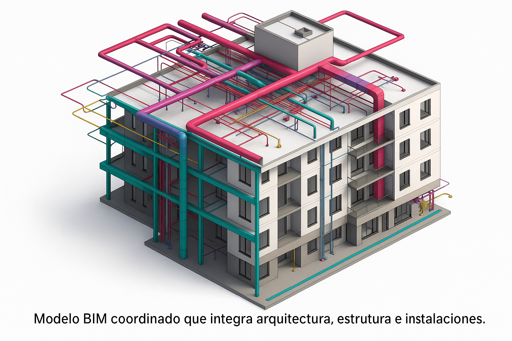

*Modelo BIM coordinado que integra arquitectura, estructura e instalaciones.*

En **Arquimétrica**, aplicamos la metodología **BIM (Building Information Modeling)** como parte de nuestro compromiso con la excelencia y la innovación.

> **¿Qué es BIM en una frase?**  
> Una forma de **centralizar la información del proyecto** (geometría, datos técnicos, tiempos y costos) en **un modelo digital inteligente** que facilita la toma de decisiones.

## Liderazgo y especialización

Gracias al liderazgo de la **Arq. Melissa Delgado**, especialista con **Máster en BIM Management (Zigurat & Universitat de Barcelona)**, ofrecemos modelos que integran:

- **Geometría** detallada por disciplinas.  
- **Datos técnicos** trazables.  
- **Cronogramas** (4D) y **costos** (5D).

*Detección temprana de interferencias entre disciplinas.*

*Simulación 4D: obra planificada y comunicada con claridad.*

## Beneficios clave (en la práctica)

- ✅ **Detectar interferencias** antes de construir.  
- ✅ **Mediciones y presupuestos precisos** con extracción directa del modelo.  
- ✅ **Mejor coordinación** entre arquitectos, ingenieros y constructores.  
- ✅ **Documentación constructiva** clara y actualizada.

### Resultado
Menos reprocesos, **mejores plazos** y **mayor certidumbre** de costos.

## Casos de uso frecuentes

1. **Coordinación interdisciplinaria:** reuniones de clash-detection con acuerdos trazables.  
2. **Planificación 4D:** simulaciones por fases para anticipar cuellos de botella.  
3. **Control 5D:** presupuesto vinculado a partidas reales del modelo.  
4. **Entrega digital:** planos, vistas y listados consistentes con el estado del modelo.

*Documentación y listados generados directamente del modelo.*

---

### Conclusión

La **gestión BIM** no es solo una herramienta; es una **filosofía de trabajo** que transforma la forma en que concebimos y ejecutamos cada proyecto. En Arquimétrica, la adoptamos para **reducir riesgos**, **aumentar la calidad** y **entregar mejores resultados**.

> ¿Le gustaría ver un demo aplicado a su proyecto?  
> Contáctenos y preparamos una **muestra 4D/5D** con sus alcances.
